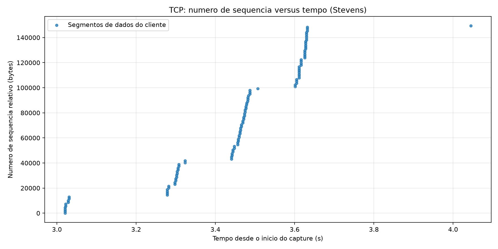
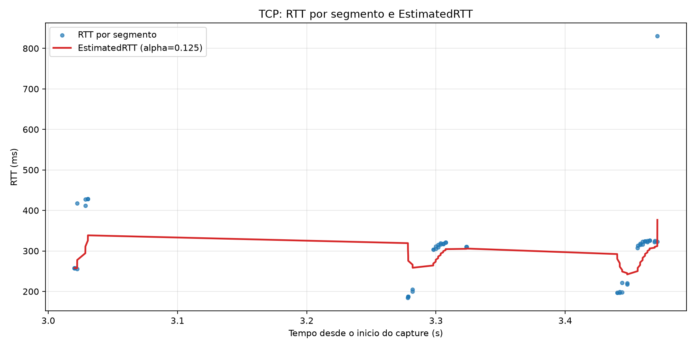
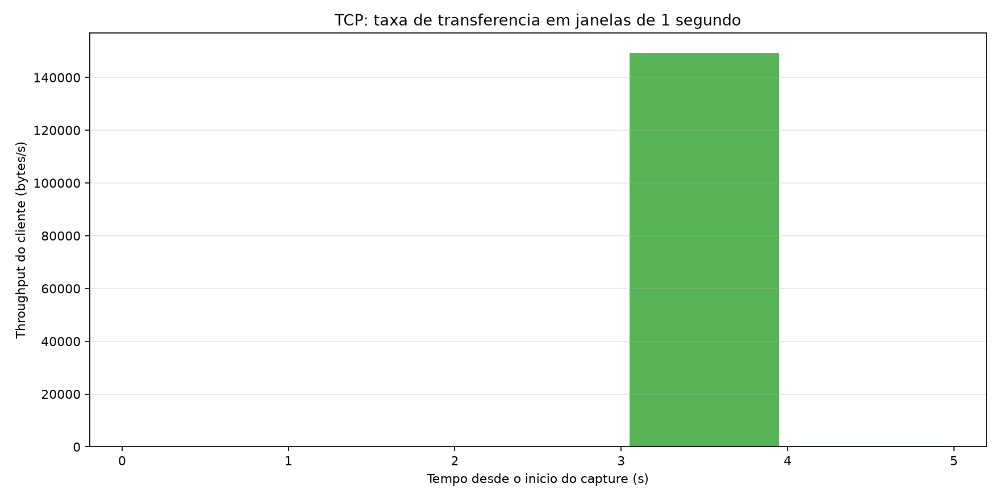

# Analise da conexao TCP

Arquivo analisado: `files/tcp-capture-lucas-felix.pcapng`  
Ferramenta: Python com `scapy` para decodificacao do PCAPNG e `matplotlib` para os graficos. A escolha permite automatizar a identificacao do fluxo, o calculo de RTT e a reproducibilidade do relatorio.

Fluxo analisado: `192.168.15.141:37388` -> `128.119.245.12:80`  
Segmentos de dados do cliente: 105  
Bytes transferidos pelo cliente: 149758  
Duracao ate o ultimo segmento de dados: 4.045 s

## 1. Numero de sequencia e fleets

O grafico mostra os segmentos de dados enviados pelo cliente, com o numero de sequencia relativo ao primeiro segmento no eixo vertical. Agrupamentos quase verticais representam fleets: varios segmentos transmitidos em um intervalo curto. Espacos maiores entre agrupamentos indicam espera, por exemplo, devido ao ACK clocking, ao controle de congestionamento ou a uma retransmissao.

O throughput termina abaixo do início, sugerindo perda, redução da janela ou fim da transferência; compare com os gaps/fleets do gráfico 1. A periodicidade dos fleets deve ser relacionada ao RTT: em TCP, os ACKs liberam novos dados e a janela de congestionamento controla quantos bytes podem permanecer em voo. O grafico nao prova sozinho a fase exata, pois perdas, delayed ACK e limitacoes do emissor tambem podem produzir padroes semelhantes.

## 2. RTT e EstimatedRTT

O RTT por segmento foi estimado associando cada segmento de dados ao primeiro ACK posterior que confirma seu numero de sequencia final, aceitando ACK cumulativo. Foram obtidas 54 amostras. O RTT medio foi 300.37 ms e o maior valor foi 830.41 ms. Valores muito acima da media sao candidatos a outliers; a curva EstimatedRTT reage lentamente por usar alpha=0.125. Pela formula do livro-texto, EstimatedRTT = (1 - alpha) * EstimatedRTT anterior + alpha * SampleRTT, com alpha = 0,125; portanto, a curva filtrada suaviza picos e atrasos isolados, mas tambem demora a acompanhar uma mudanca persistente.

## 3. Throughput

O throughput foi calculado somando os bytes de dados enviados pelo cliente em janelas de 1 segundo. O total foi 149758 bytes. A primeira janela nao nula foi 149362 bytes/s, o pico foi 149362 bytes/s por volta de 3.5 s e a ultima janela nao nula foi 396 bytes/s.

A leitura conjunta deve comparar as barras com o grafico de sequencia: fleets mais densos e maiores tendem a elevar a taxa; gaps e fleets menores tendem a reduzi-la. Crescimento inicial e posterior estabilizacao sao coerentes com slow start seguido de congestion avoidance, enquanto quedas abruptas podem indicar perda ou esgotamento da aplicacao. A janela de 1 segundo reduz ruido, mas pode esconder variacoes em escala de RTT.

## Observacao metodologica

O script analisa apenas dados enviados pelo cliente detectado pelo primeiro SYN e ignora retransmissoes na contagem de bytes do throughput apenas na medida em que elas aparecem como bytes capturados; por isso, o valor representa bytes observados no capture, nao necessariamente bytes entregues unicos na aplicacao.
