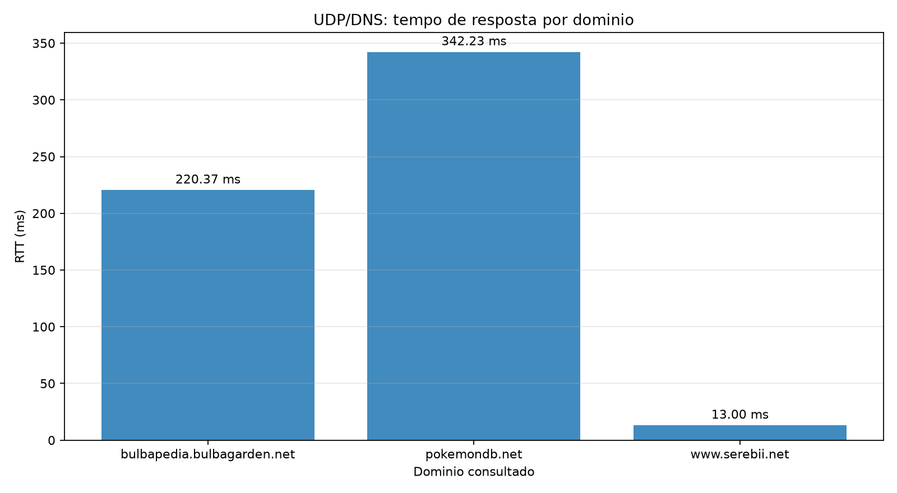
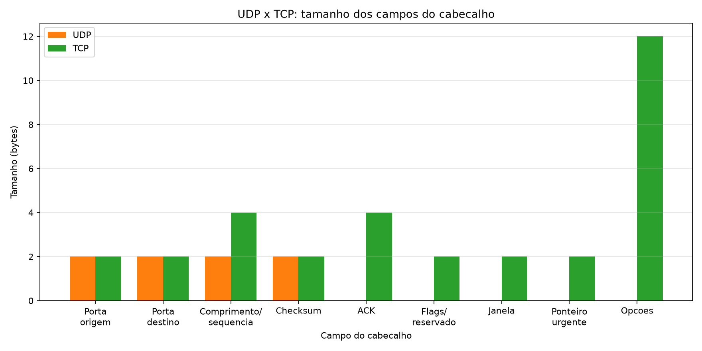

# Analise do trafego UDP

Arquivo analisado: `files/udp-capture-lucas-felix.pcapng`  
Ferramenta: Python com `scapy` e `matplotlib`.

Dominios alvo: bulbapedia.bulbagarden.net, pokemondb.net, www.serebii.net

## 1. RTT das consultas DNS

O RTT foi calculado como a diferenca entre o timestamp da consulta DNS e o timestamp da resposta correspondente. A associacao usou o ID da transacao DNS, o nome consultado, as portas UDP e os enderecos IP invertidos.

A consulta com maior RTT foi **pokemondb.net**, com **342.23 ms**. A menor foi **www.serebii.net**, com **13.00 ms**. A diferenca pode ser explicada pelo cache do resolvedor local, pela necessidade de consultar servidores autoritativos, pela localizacao/topologia desses servidores e pela carga ou fila da rede no instante da captura. O grafico mede o caminho ate o resolvedor `192.168.15.1`; portanto, nao identifica sozinho qual desses fatores dominou.

## 2. Campos dos cabecalhos UDP e TCP

O cabecalho UDP tem apenas quatro campos de 2 bytes: portas de origem e destino, comprimento e checksum, totalizando **8 bytes**. No TCP capturado, os campos equivalentes de portas e checksum tambem tem 2 bytes, mas o cabecalho inclui sequencia (4), ACK (4), flags/reservado (2), janela (2), ponteiro urgente (2) e opcoes. O tamanho TCP observado com maior frequencia foi **32 bytes**, dos quais **12 bytes** sao opcoes.

Assim, UDP nao possui numeracao de sequencia, confirmacao, janela, flags de controle ou ponteiro urgente. Essa ausencia revela a simplicidade e baixo overhead do UDP: confiabilidade, ordenacao, retransmissao e controle de fluxo ficam a cargo da aplicacao, enquanto o TCP implementa esses mecanismos no proprio transporte.
